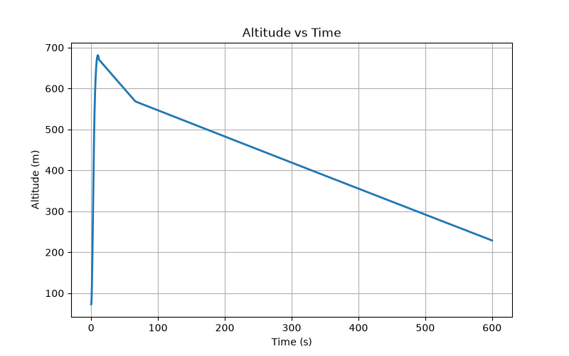
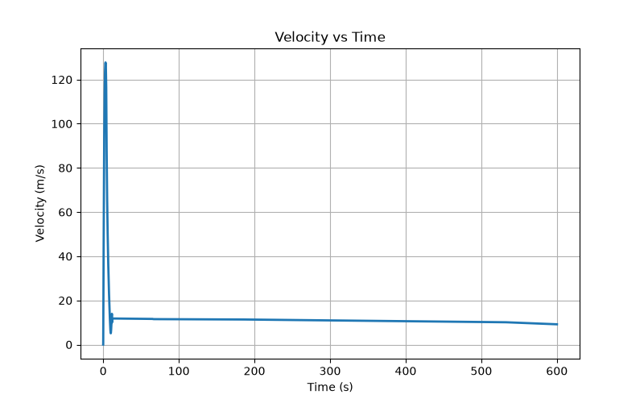
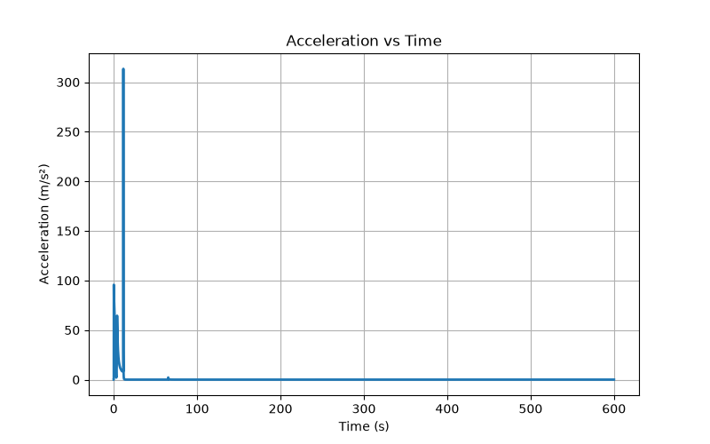

# Flight Data Analyzer

A Python-based engineering tool for post-processing rocket flight simulation data. The program imports flight telemetry from CSV files, computes key performance metrics, generates engineering plots, and produces an automated flight report.

---

## Overview

Flight simulations generate large amounts of telemetry data that require post-processing to evaluate vehicle performance. This project automates the analysis of rocket flight data by extracting important flight parameters and visualizing them through engineering plots.

The analyzer is designed for aerospace engineering students working with RocketPy simulations or other rocket flight datasets stored in CSV format.

---

## Features

- Import flight data from CSV files
- Compute maximum altitude
- Compute maximum velocity
- Compute maximum acceleration
- Calculate simulation duration
- Calculate average flight parameters
- Generate Altitude vs Time plot
- Generate Velocity vs Time plot
- Generate Acceleration vs Time plot
- Generate an automated flight report (.txt)
- Modular and well-documented Python code

---

## Technologies Used

- Python 3
- Pandas
- Matplotlib

---

## Project Structure

```text
Flight-Data-Analyzer/
│
├── analyzer.py
├── plots.py
├── report.py
├── main.py
│
├── sample_data/
│   └── flight_data.csv
│
├── reports/
│   └── flight_report.txt
│
├── screenshots/
│   ├── altitude_vs_time.png
│   ├── velocity_vs_time.png
│   ├── acceleration_vs_time.png
│   └── flight_dashboard.png
│
├── README.md
├── requirements.txt
├── .gitignore
└── LICENSE
```

---

## Installation

Clone the repository

```bash
git clone https://github.com/Anuj-777/Flight-Data-Analyzer.git
```

Move into the project directory

```bash
cd Flight-Data-Analyzer
```

Install the required packages

```bash
pip install -r requirements.txt
```

Run the program

```bash
python main.py
```

---

## Example Output

```text
========== FLIGHT SUMMARY ==========

Maximum Altitude (m)               : 681.28
Maximum Velocity (m/s)             : 127.73
Maximum Acceleration (m/s²)        : 313.46
Simulation Duration (s)            : 600.00

Minimum Altitude (m)               : 72.56
Average Altitude (m)               : 415.72

Minimum Velocity (m/s)             : 0.00
Average Velocity (m/s)             : 51.70

Minimum Acceleration (m/s²)        : 0.00
Average Acceleration (m/s²)        : 31.28

====================================
```

---

## Sample Visualizations

### Altitude vs Time

<p align="center">

</p>

### Velocity vs Time

<p align="center">

</p>

### Acceleration vs Time

<p align="center">

</p>

---

## Engineering Applications

- Rocket flight data post-processing
- RocketPy simulation analysis
- Flight performance evaluation
- Aerospace engineering coursework
- Engineering data visualization
- Telemetry analysis

---

## Future Improvements

- Interactive dashboard using Plotly
- Multi-flight comparison
- Automatic apogee detection
- Landing event detection
- Interactive GUI
- Support for additional telemetry parameters
- Export reports in PDF format

---

## Notes

The sample dataset included in this repository was generated from a RocketPy simulation. The reported simulation duration corresponds to the duration of the exported simulation data.

---

## Author

**Anuj Mangaj**

Aerospace Engineering Student

**Areas of Interest**

- Rocket Flight Dynamics
- Flight Simulation
- Aerodynamics
- Aerospace Software Development
- Python for Engineering
- Engineering Data Analysis